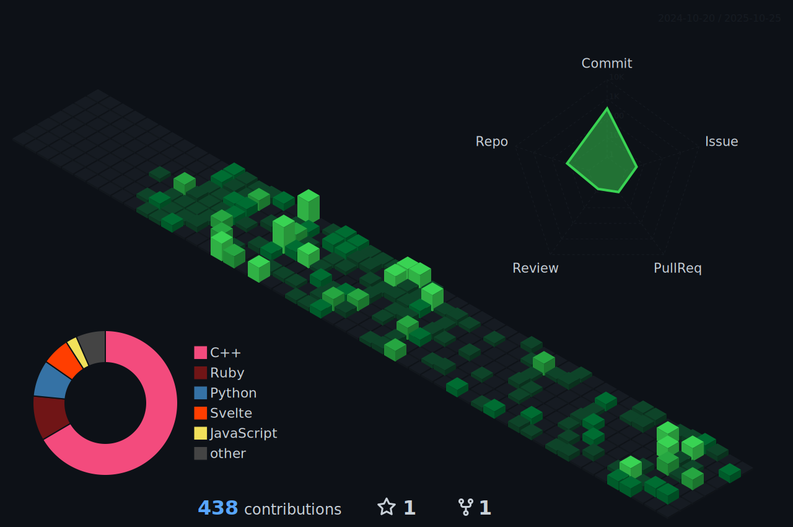

# 🐰 Haerin Enthusiast | Po-Yu (Poe)
🇹🇼 -> 🗽

<!-- <table>
  <tr>
    <td width="60%" align="center">
      
    </td>
    <td width="40%" align="center">
      
    </td>
  </tr>
  <tr>
    <td colspan="2" align="center">
      
    </td>
  </tr>
</table> -->

